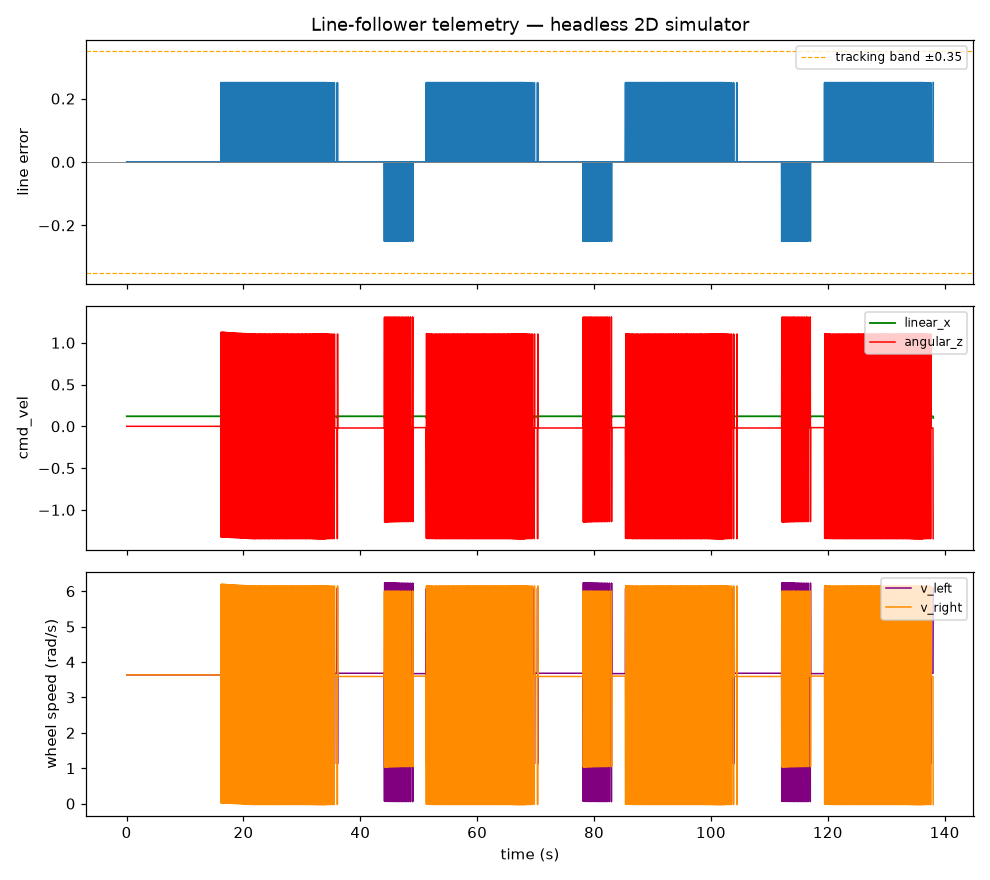
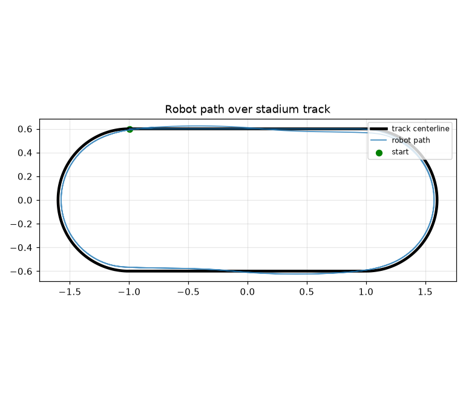

# ROS 2 Line Follower Robot

A robust, modular line-following robot built with **ROS 2** and **Python**, featuring a closed-loop **PID control system** that processes track data and dynamically adjusts differential-drive velocities in a simulated Gazebo environment.

The architecture is designed with **hardware-in-the-loop transitions** in mind. The software stack mirrors the structure required for a physical Arduino-based robot, allowing deployment to real hardware by replacing the simulation sensor and actuator interfaces.

> **Headless simulator included** — the exact same control pipeline runs as a pure-Python 2D simulator on **any OS** (Windows/macOS/Linux) with no ROS2 or Gazebo install. This is how the control code is verified before touching Gazebo.

---

## 🚀 Key Features

* **Low-Latency Control Loop** — Best-Effort QoS across the sensor pipeline drops stale frames instead of queueing them, reducing control lag around sharp corners.
* **Dynamic PID Parameter Tuning** — `Kp`, `Ki`, `Kd`, and speed constraints can be modified at runtime without restarting the simulation (`ros2 param set /pid_controller_node Kp 0.9`).
* **Intelligent Cornering** — dynamically reduces base linear velocity as tracking error grows, slowing the robot before sharp turns.
* **Modular Control Architecture** — sensing, control, and motor-command processing are independent ROS 2 nodes, easy to debug, extend, and port to hardware.
* **Differential-Drive Kinematics** — converts commanded `Twist` velocities into left/right wheel velocity commands.
* **Procedural Track Generation** — `generate_track.py` + `build_world.py` build new, increasingly complex test tracks from code.
* **Headless 2D Simulator** — runs the same sensor→PID→motor pipeline with lap metrics and telemetry plots, no ROS2 needed.
* **Robust Line-Loss Handling** — when the line is lost, the held error decays to zero so the robot straightens out and re-searches instead of steering the same way forever.

---

## 🏗️ System Architecture

```
                 Camera Image
                      │
                      ▼
              ┌────────────────┐
              │  sensor_node   │
              │                │
              │ ROI Processing │
              │ 5 Virtual IR   │
              │ Zones          │
              └───────┬────────┘
                      │
                /line_sensor
                      │
                      ▼
             ┌──────────────────┐
             │ pid_controller   │
             │                  │
             │ PID Control      │
             │ Speed Scaling    │
             └────────┬─────────┘
                      │
                   /cmd_vel
                      │
              ┌───────┴─────────┐
              │                 │
              ▼                 ▼
       Gazebo DiffDrive    motor_driver
          Plugin               │
                              ▼
                     /wheel_velocity
```

### Shared Control Models

The ROS 2 nodes and the headless simulator both import the **same** pure-logic modules, so what you tune and verify headlessly is exactly what runs in Gazebo:

| Module | Role |
| ------ | ---- |
| `sensor_model.py` | 5-zone virtual IR array → normalized error in [-1, 1] |
| `pid_model.py` | PID with anti-windup + dynamic cornering speed scaling |
| `motor_model.py` | Differential-drive kinematics (Twist ↔ wheel speeds) |

### ROS 2 Nodes

| Node             | Input Topic                               | Output Topic                                     | Role |
| ---------------- | ----------------------------------------- | ------------------------------------------------ | ---- |
| `sensor_node`    | `/camera/image_raw` (`sensor_msgs/Image`) | `/line_sensor` (`std_msgs/Float32`)              | Processes the downward camera image, extracts the line, divides it into five virtual sensor zones, and computes a normalized tracking error in [-1, 1]. |
| `pid_controller` | `/line_sensor` (`std_msgs/Float32`)       | `/cmd_vel` (`geometry_msgs/Twist`)               | PID steering correction + dynamic linear-speed control. |
| `motor_driver`   | `/cmd_vel` (`geometry_msgs/Twist`)        | `/wheel_velocity` (`std_msgs/Float32MultiArray`) | Converts differential-drive `Twist` into left/right wheel velocities. |
| `logger_node`    | `/line_sensor`, `/cmd_vel`                | —                                                | Writes CSV telemetry (timestamp, error, linear_x, angular_z). |
| `monitor_node`   | `/wheel_velocity`                         | —                                                | Terminal dashboard of wheel speeds / steering. |

> **Simulation Note:** In Gazebo, the DiffDrive plugin directly consumes `/cmd_vel`. The `motor_driver` node remains active to provide wheel-command telemetry and maintain architectural parity with a future physical robot.

---

## ⚙️ Requirements

### Gazebo Simulation (Ubuntu 24.04)

* **OS:** Ubuntu 24.04 LTS
* **ROS 2:** Jazzy Jalisco
* **Simulation:** Gazebo Harmonic (default for ROS 2 Jazzy)
* **Terminal Automation:** Tilix

```bash
sudo apt update
sudo apt install ros-jazzy-ros-gz tilix rqt ros-jazzy-rqt-reconfigure
rosdep update
rosdep install --from-paths src -y --ignore-src
```

### Headless Simulator (any OS)

Just Python 3 + numpy + matplotlib — no ROS2, no Gazebo.

```bash
pip install numpy matplotlib
```

---

## 🛠️ Installation & Build

### 1. Create a ROS 2 Workspace

```bash
mkdir -p ~/ros2_az/src
cd ~/ros2_az/src
```

### 2. Clone the Repository

```bash
git clone <repository_url> line_follower_az
```

### 3. Build the Workspace

```bash
cd ~/ros2_az
make build
```

---

## 🕹️ Usage

### Quick Start (full Gazebo simulation)

```bash
make sim
```

The automated Tilix layout provides:
* **Left Pane:** Gazebo interface and ROS-Gazebo bridge
* **Top-Right Pane:** Sensor, PID, and motor-driver logs
* **Bottom-Right Pane:** Live `/cmd_vel` telemetry

### Headless Simulator (no ROS2 — runs anywhere)

```bash
# From the package directory:
python3 -m line_follower_az.simulator --laps 3

# Options
python3 -m line_follower_az.simulator --laps 3 --speed 0.12 --noise 0.05 --seed 1
```

Outputs lap metrics to the console and writes `telemetry.png` + `track_path.png` to `results/`.





### Run the Verification Suite (no ROS2 needed)

```bash
make test
```

Runs three tests: sensor math, PID sign chain, and a full 2-lap simulator integration test. All must pass green.

---

## 🎛️ PID Control

The line-following controller uses a conventional PID formulation:

```
Control Output = Kp × Error + Ki × Integral(Error) + Kd × Derivative(Error)
```

The normalized line error ranges:

```
-1.0 ─────────── 0.0 ─────────── +1.0
 Left            Center           Right
```

The controller uses this error to adjust angular velocity while dynamically scaling linear velocity.

### PID Parameters

| Parameter           | Purpose                                                                    |
| ------------------- | -------------------------------------------------------------------------- |
| `Kp`                | Strength of the immediate steering correction.                             |
| `Ki`                | Corrects accumulated tracking error and long-term drift.                   |
| `Kd`                | Dampens rapid error changes and improves stability around sharp turns.     |
| `base_linear_speed` | Maximum forward speed on straight sections.                                |
| `min_linear_speed`  | Forward speed when error is large (slow down in corners).                  |
| `max_angular_z`     | Clamp on the steering command.                                             |
| `integral_clamp`    | Anti-windup clamp on the accumulated integral term.                        |
| `line_loss_decay`   | Per-frame decay of the held error when the line is lost (robustness).      |

For typical line-following, `Ki` can be kept low or disabled because accumulated error is often less useful than proportional and derivative correction.

---

## 📂 Project Structure

```
ros2-line-follower-robot/
├── Makefile                         # Build, simulation & automation commands
├── README.md                        # This document
├── REQUIREMENTS.md                  # System and software requirements
├── .gitignore
└── src/
    └── line_follower_az/
        ├── config/                  # YAML configuration and parameters
        │   ├── bridge_config.yaml
        │   └── pid_params.yaml
        ├── description/             # URDF robot descriptions
        │   └── line_follower.urdf
        ├── launch/                  # ROS 2 launch files
        │   ├── nodes.launch.py
        │   └── simulation.launch.py
        ├── line_follower_az/        # Main Python ROS 2 package
        │   ├── sensor_model.py      #   shared: 5-zone line sensor
        │   ├── pid_model.py         #   shared: PID controller
        │   ├── motor_model.py       #   shared: diff-drive kinematics
        │   ├── simulator.py         #   headless 2D simulator
        │   ├── sensor_node.py
        │   ├── pid_controller_node.py
        │   ├── motor_driver_node.py
        │   ├── logger_node.py
        │   └── monitor_node.py
        ├── scripts/                 # Utility and testing scripts
        │   ├── generate_track.py    #   procedural track SDF generator
        │   ├── build_world.py       #   assembles the .world from code
        │   ├── test_sensor_math.py
        │   ├── test_pid_sign_chain.py
        │   └── test_simulator.py
        └── worlds/                  # Gazebo simulation environments
            └── line_track.world
```

---

## 🔄 Hardware Transition

The project follows a modular architecture intended to simplify migration from simulation to a physical robot.

```
Simulation                     Physical Robot
──────────                     ──────────────

Camera Image      ───────►     IR Sensor Array
     │                              │
     ▼                              ▼
sensor_node        ───────►     sensor_node
     │                              │
     └──────────────┬───────────────┘
                    ▼
             PID Controller
                    │
                    ▼
                /cmd_vel
                    │
                    ▼
             Motor Interface
                    │
                    ▼
              Physical Motors
```

The **PID controller and high-level control architecture can remain largely unchanged**, while the sensor-acquisition and motor-output layers are adapted for the target hardware.

---

## 🧪 Testing & Evaluation

The headless verification suite runs on any OS with no ROS2:

```bash
make test
```

| Test | What it verifies |
| ---- | ---------------- |
| `test_sensor_math.py` | 5-zone line detection reports correct error sign/magnitude for left/center/right lines. |
| `test_pid_sign_chain.py` | PID → Twist → wheel-speed sign convention steers the robot back toward the line. |
| `test_simulator.py` | Full 2-lap run: robot stays within the tracking band (≥0.90), mean error ≤0.25, completes in time. |

Additional evaluation metrics (via the simulator): line-tracking stability, lap completion time, maximum sustainable speed, cornering behavior, tracking error, overshoot, and recovery after losing the line.

---

## 🧹 Workspace Maintenance

```bash
make clean    # remove build artifacts
make build    # rebuild
```

Useful after renaming nodes, modifying dependencies, changing package structure, or experiencing stale build artifacts.

---

## 📖 Documentation

| Document                             | Description                                                      |
| ------------------------------------ | ---------------------------------------------------------------- |
| [`README.md`](README.md)             | Project overview, architecture, installation, and technical details |
| [`REQUIREMENTS.md`](REQUIREMENTS.md) | Complete system, software, ROS 2, and dependency requirements    |

---

## 📄 License

MIT